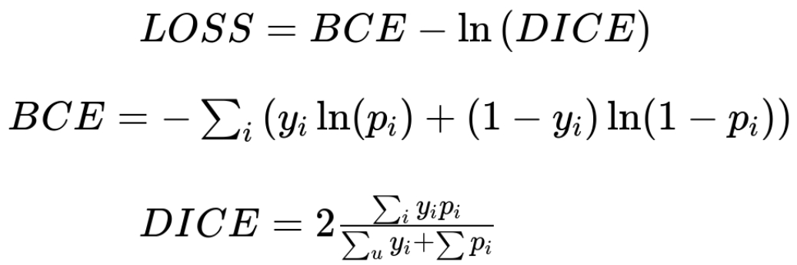

### Hyper-parameter tuning 

In order to get the best hyper-paramters, in the experiments process, we firstly start the hyper-paramters searching process. 
We focus on tuning the learning rate, lamda (the loss weight in IC net), and the training epochs. Speficially, 
we run the experiments with following paramters:

| Learning Rate     | Lambda1-3   | Training Epoch  |
| :--------: |:-------------:| :-----:|
| 0.05      | (0.16, 0.40, 1.0) | 200 |
| 0.01      | (0.16, 0.50, 1.0)      | 100 |
| 0.005 | (0.16, 0.30, 1.0)      | 80 |
| 0.001 | (0.20, 0.40, 1.0)      | 40 |
| 0.0005 | (0.12, 0.40, 1.0)      | 20 |
| 0.0001 | (0.16, 0.40, 1.0)      | 10 |
|  | (0.16, 0.40, 1.2)      | 5 |
|  | (0.16, 0.40, 0.8)      ||

For the tuning of learning rate, we compare its mIoU on validation set, and the learning rate with 0.0005 reached the 
highest mIoU.  

And for the tuning of lambda, we get the following results, and the best setting of lambda is ...

For the tuning of learning, not only we aim to find the best setting of leanring, we also try to detect 
whether over-fitting/under-fitting happens with different training epochs by comparing the curve of training loss 
and validation loss. 

The best training epoch is 200.

And the following figure show the comparing of training loss and validation loss under different settingof epoch 
which can use to detect where over-fitting or under-fitting happens

 

### Modification on Loss Function

In segmentation problem, especially in multi-class segmentation problem, the cross-entropy loss is commonly used, which 
is also being adopted in the IC-net model. But in Caravana Image Masking Challenge, since we aim to solve a binary 
segmentation problem, therefore, the DICE coefficient loss can be used which may improve the overall performance of the
model.

So we designed the following loss function: 

And we compare the performance of two different loss functions:

 
The performance is a little bite degraded using modified loss, by referring the results we get from the data exploring process, this 
maybe attribute to the dataset is quite clean, and the ratio of a car in the whole picture is quite balanced, so the 
dice coefficent loss did not bring too much benefits.

### Train From Scratch or Using Pre-Trained Model
In our training flow, we use the IC-net pre-trained model that was trained on cityscapes dataset. Using a pre-trained 
model is a very common method to boost the training process by giving the model a quite good initial weight. Then we
apply the pre-trained model on our Carvana Image Masking Challenge dataset. Also, we compare this method with the
training from scratch manner.

The results show a huge performance improvement on using pre-trained model. This may be conducted by that deep learning 
method always required long time of training and huge amount of training data when using a single model. Therefore,
training from scratch show a very poor performance.

### Use Tuned Hyper-parameter for training.
After the previous training phase, we select the hyper-parameter that demonstrate the best result and combine them to 
conduct one experiments. As the previous tuning results showed, we set the learning rate to 0.0005, lambda to 
(0.16, 0.3, 1.0) and the training epoch to 200.
 
After the training, the mIoU on validation set is degraded as shown in the figure.

The reason of this is may caused by the fact
that the different hyper-parameter may have a inter-influence between each other. We may conduct a more concise way to 
do the hyper-parameter searching process, starting by the most important hyper-parameter, then the next one.

### Data Augmentation 
In the training dataset, we only have around 5,000 images, whereas in the test set, we have around 10,000 images. In 
order to solve the limited train data, we adopted the data augmentation method in our experiments. We apply the random 
mirroring method and random scaling method to the original dataset and conduct the following experiments.

Instead of directly mixing the augmentation dataset into the original dataset, we use them in the way that, for instance, under the 
setting of n training epochs, we use the original dataset in the first x training epoch, in the rest y epochs, we use 
the augmentation dataset for training.

Specifically, we conduct the following experiments:

|              | Experiment 1 | Experiment 2 | Experiment 3 | 
| :----------: | :----------: | :----------: | :----------: |
| Stage 1      | Original 10 epoch| Original 10 epoch| Original 10 epoch|
| State 2      | Random Mirror 10 epoch| Random Scale 10 epoch| Random Scale 5 epcoch|
| State 3      |        |        |  Random Mirror 5 Epoch|

And we get the following results:

### Ensemble Method
To further improve the performance, we use the most common ensemble method that is wildly used in Kaggle Competition. 
To the best of our knowledge. the [TernausNet](https://arxiv.org/abs/1801.05746) is one of the state-of-art segmentation model that even specifically 
designed for the Kaggle Carvana dataset. We use the naive ensemble method by comuting the weighted average of the 
probability of labels given by two models' output, and use this as the final output.

Let the a, b denote the weights and a + b = 1.0, let x denote the output probability on car label of IC-net and y denote
the probability on car label of TernausNet. The ensemble output z = a * x + b * y. And if z > 0.5, the corresponding 
pixel is predicted to be the car, otherwise is background.

We ensemble the TernausNet with different models that are retrieved from our previous experiments results. 
By trying different weight from (0.4, 0.6), (0.5, 0.5), and select the best one. 

The following figure show the result of ensemble method:

There is a very significant improvement as our expected (mIoU improve from 0.88 to 0.93). Moreover, we visualize some 
results to show this improvement.

### Inference Time
Another important metric of segmentation algorithm is the processing time of the model. We compute the average inference
time of the images in the validation set using the IC-net model, baseline K-means method and ensemble method.

|IC net| Ensemble |
|:----:|:----:|
|0.301050 | 0.63298 |

### Test from Real World Data
To further test the performance of our model and testing its generalization ability, we scrawl som images from the 
Internet and the results are shown below:

As we can see, the performance is very poor under the real world data. This is attributed to the fact that our training
dataset is very clean, and contains very little noise in the background. But in the real-world data, the background 
could contain many different objects that are not shown in the training dataset.

### Kaggle Submission Result
In the very last stage, we choose some of our results and upload to the Kaggle for testing.

One of our best model get the score of xxx and rank in xx%.

## Conclusion
In our project, we apply the IC net, which is a state-of-art segmentation model into the Kaggle Carvana dataset. By using 
the deep learning training techniques and knowledge from this course, we firstly build a overall training and testing 
pipeline based on Tensorflow.

In the experiments section, we use the hyper-parameter searching to find the best parameter 
setting, also we try using different design of loss function and compare the results. Then considering the limited training 
dataset, we use the data augmentation method to acquire a larger dataset. Lastly, in order to further improve the performance, 
we ensemble the TernausNet with our method which lead to a better performance. Moreover, we collect the inference time of 
the models and try our model in the real-wold data by scrawling. 

