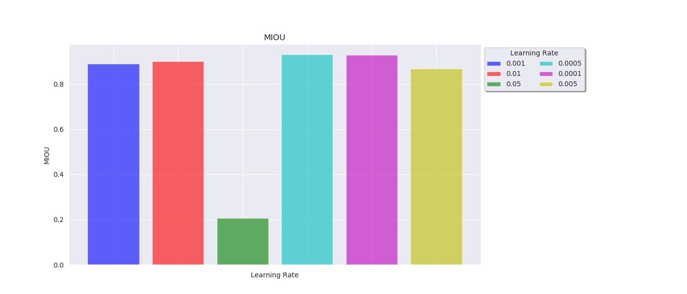
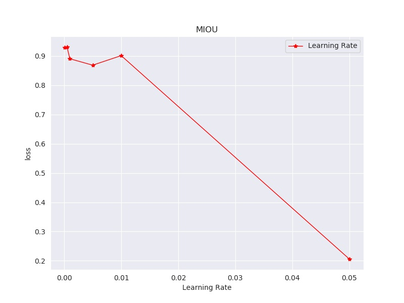
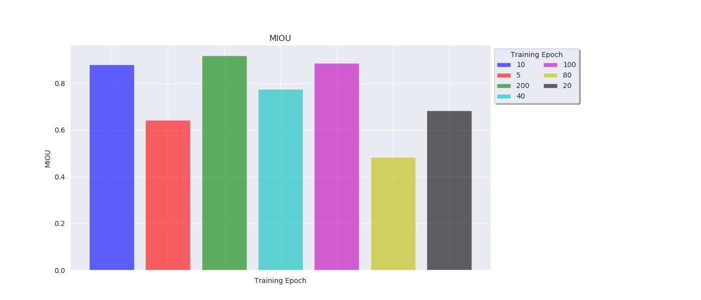

### Hyper-parameter tuning 

In order to get the best hyper-paramters, in the experiments process, we firstly start the hyper-paramters searching process. 
We focus on tuning the learning rate, lamda (the loss weight in IC net), and the training epochs. Speficially, 
we run the experiments with following paramters:

| Learning Rate     | Lambda1-3   | Training Epoch  |
| :--------: |:-------------:| :-----:|
| 0.05      | (0.16, 0.40, 1.0) | 200 |
| 0.01      | (0.16, 0.50, 1.0)      | 100 |
| 0.005 | (0.16, 0.30, 1.0)      | 80 |
| 0.001 | (0.20, 0.40, 1.0)      | 40 |
| 0.0005 | (0.12, 0.40, 1.0)      | 20 |
| 0.0001 | (0.16, 0.40, 1.0)      | 10 |
|  | (0.16, 0.40, 1.2)      | 5 |
|  | (0.16, 0.40, 0.8)      ||

For the tuning of learning rate, we compare its mIoU on validation set, and the learning rate with 0.0005 reached the 
highest mIoU.  

And for the tuning of lambda, we get the following results, and the best setting of lambda is ...

For the tuning of learning, not only we aim to find the best setting of leanring, we also try to detect 
whether over-fitting/under-fitting happens with different training epochs by comparing the curve of training loss 
and validation loss. 

The best training epoch is 200.

And the following figure show the comparing of training loss and validation loss under different setting of epoch.

 

### Modification on Loss Function

In segmentation problem, especially in multi-class segmentation problem, the cross-entropy loss is commonly used, which 
is also being adopted in the IC-net model. But in Caravana Image Masking Challenge, since we aim to solve a binary 
segmentation problem, therefore, the DICE coefficient loss can be used which may improve the overall performance of the
model.

So we designed the following loss function: 

And we compare the performance of two different loss functions:

 
The performance is degraded using modified loss, by referring the results we get from the data exploring process, this 
maybe attribute to the dataset is quite clean, and the ratio of a car in the whole picture is quite balanced, so the 
dice coefficent loss did not bring too much benefits, even degrade the performance.[???]

### Train From Scratch or Using Pre-Trained Model
In our training flow, we use the IC-net pre-trained model that was trained on cityscapes dataset. Using a pre-trained 
model is a very common method to boost the training process by giving the model a quite good initial weight. Then we
apply the pre-trained model on our Carvana Image Masking Challenge dataset. Also, we compare this method with the
training from scratch manner.

The results show a huge performance improvement on using pre-trained model.
